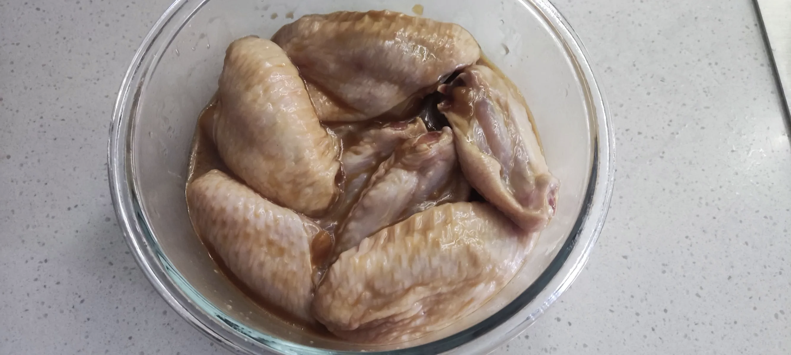

## 1. 食材清单

- 鸡翅：10 个
- 蒜头：2 瓣
- 生姜：2 ~ 5 片
- 盐：5 ~ 10 g
- 鸡精：5 ~ 10 g
- 糖：20 ~ 30 g
- 耗油：10 ~ 20 g
- 生抽：30 ~ 40 g
- 纯芝麻油：10 ~ 20 g
- 淀粉：30 ~ 40 g
- 水：视情况而定，如果感觉干，下次腌制的时候可以适当加一些
- 腌制鸡肉，通用的配方，不仅限于鸡翅。

## 2. 制作流程

- 将所有用料混合，抓匀，丢保鲜袋里边，放入冰箱，腌制半天到一天时间。
- 取出，丢空气炸锅，调 200℃、20min
- 
